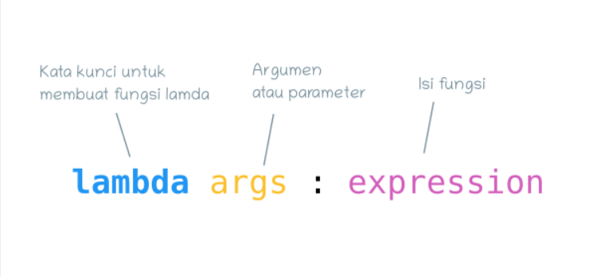

# praktikum06
## Tugas pertemuan ke 11
```sh
Nama    : A. Reza Baehaqa Jamroni
Nim     : 312110494
Matkul  : Bahasa Perograman
```
### Latihan
Lambda expression di Python adalah sebuah ekspresi untuk membuat fungsi.<p>
intinya, lambda digunakan untuk membuat fungsi dalam satu baris ekspresi.<p>

Ini adalah format untuk membuat fungsi lambda:<p>

Lambda bisa memiliki lebih dari satu argumen atau parameter, tapi hanya bisa memiliki satu ekspresi atau isi.<p>
latihan ini terdapat 4 untuk mengubah menjadi fungsi lambda yaitu di bawah ini:<p>
```sh
1.)
a=lambda x: (x**2)
print(a(6))

2.)
b=lambda x,y: math.sqrt(x**2 + y**2)
print(b(2,3))

3.)
c=lambda *args:sum(args)/len(args)
print(c(8))

4.)
d=lambda s: "".join(set(s))
print(d("Reza Baehaqa"))
```

### Praktikum
