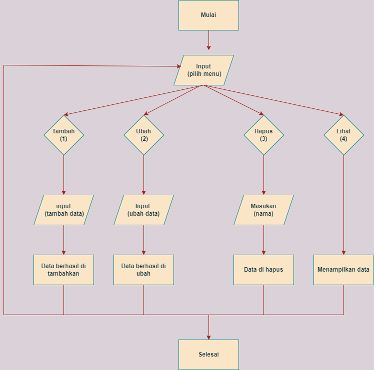

# praktikum06
## Tugas pertemuan ke 11
```sh
Nama    : A. Reza Baehaqa Jamroni
Nim     : 312110494
Matkul  : Bahasa Perograman
```
### Latihan
Lambda expression di Python adalah sebuah ekspresi untuk membuat fungsi.<p>
intinya, lambda digunakan untuk membuat fungsi dalam satu baris ekspresi.<p>

Ini adalah format untuk membuat fungsi lambda:<p>
<p>

Lambda bisa memiliki lebih dari satu argumen atau parameter, tapi hanya bisa memiliki satu ekspresi atau isi.<p>
latihan ini terdapat 4 untuk mengubah menjadi fungsi lambda yaitu di bawah ini:<p>
```sh
1.)
a=lambda x: (x**2)
print(a(6))

2.)
b=lambda x,y: math.sqrt(x**2 + y**2)
print(b(2,3))

3.)
c=lambda *args:sum(args)/len(args)
print(c(8))

4.)
d=lambda s: "".join(set(s))
print(d("Reza Baehaqa"))
``` 
<p>
Berikut adalah output hasil dari program yang kita bikin


### Praktikum
Buat program sederhana dengan mengaplikasikan penggunaan fungsi yang akan menampilkan daftar nilai mahasiswa, dengan ketentuan:<p>
• Fungsi tambah() untuk menambah data<p>
• Fungsi tapilkan() untuk menampilkan data<p>
• Fungsi hapus(nama) untuk menghapus data berdasarkan nama<p>
• Fungsi ubah(nama) untuk mengubah data berdasarkan<p>
### Penjelasan
sebelum kita membuat program tersebut kita perhatikan bagan flowchartnya guna memudahkan dalam membuatnya : 
 <p>

• Buatlah dictionary yang akan diinput dengan data
```sh
dataMhs = {}
```
• Membuat perulangan dan keterangan untuk pilihan menu
```sh
while True:
    print('\ntambah\t(1)\nubah\t(2)\nhapus\t(3)\nlihat\t(4)')
```
• Selanjutnya kita membuat format percabangan if, elif dan else untuk memasukan pilihan tambah (1), ubah (2), hapus (3), lihat (4)<p>
• Dengan catatan nilai Akhir diambil dari perhitungan 3 komponen nilai (tugas: 30%, uts: 35%, uas: 35%) dan syntaxnya sebagai berikut :<p>
```sh
if (c.lower() == '1'):                                               
        print('\nTambah Data Mahasiswa')
        nama= input("Masukkan Nama\t\t: ")                                        
        nim= input("Masukkan NIM\t\t: ")                                         
        nilaiTugas= int(input("Masukkan Nilai Tugas\t: "))                              
        nilaiUts= int(input("Masukkan Nilai UTS\t: "))                                   
        nilaiUas= int(input("Masukkan Nilai UAS\t: "))                                    
        nilaiAkhir= (0.30 * nilaiTugas) + (0.35 * nilaiUts) + (0.35 * nilaiUas)              
        dataMhs[nama]= nim, nilaiTugas, nilaiUts, nilaiUas, nilaiAkhir                         
        print("\nData Berhasil Ditambahkan!")
    elif (c.lower() == "2"):                                                                    
        print('\nMengubah Data Mahasiswa')
        nama = input("Masukkan Nama: ")                                                         
        if nama in dataMhs.keys():                              
            nim= input("Masukkan NIM Baru\t: ")                              
            nilaiTugas= int(input("Masukkan Nilai Tugas\t: "))                           
            nilaiUts= int(input("Masukkan Nilai UTS\t: "))                           
            nilaiUas= int(input("Masukkan Nilai UAS\t: "))                           
            nilaiAkhir= (0.30 * nilaiTugas) + (0.35 * nilaiUts) + (0.35 * nilaiUas)          
            dataMhs[nama] = nim, nilaiTugas, nilaiUts, nilaiUas, nilaiAkhir                      
            print("\nData Berhasil Di Update!")
        else:                                                                                    
            print("Data tidak ditemukan!")                                                                                             
    elif (c.lower() == '3'):                                                                    
        nama = input("Masukkan Nama:  ")                                                        
        if nama in dataMhs.keys():                                                              
            del dataMhs[nama]                                                                   
            print("Data Telah dihapus!")
        else:
            print("Data Mahasiswa Tidak Ada".format(nama))                                     
    elif (c.lower() == '4'):                                                                    
        if dataMhs.items():                                                                     
            print("\n                      DAFTAR NILAI MAHASISWA                    ")
            print("==================================================================")
            print("| No |     Nama     |    NIM    | Tugas |  UTS  |  UAS  |  Akhir |")
            print("==================================================================")
            i = 0
            for x in dataMhs.items():
                i += 1
                print("| {6:2} | {0:12s} | {1:9s} | {2:5} | {3:5} | {4:5} | {5:6} |".format(x[0], x[1][0], x[1][1], x[1][2], x[1][3], x[1][4], i))  
            print("==================================================================")
        else:
            print("\n                      DAFTAR NILAI MAHASISWA                    ")
            print("==================================================================")
            print("| No |     Nama     |    NIM    | Tugas |  UTS  |  UAS  |  Akhir |")
            print("==================================================================")
            print("|                          TIDAK ADA DATA!                       |")
            print("==================================================================")
```
• Terakhir saya menggunakan perintah break untuk mengkhiri perulangan pada suatu programnya<p>
• Berikut ini adalah contoh hasil dari output programnya yang kit buat dengan pilihan tambah (1), ubah (2), hapus (3), lihat (4) : <p>


